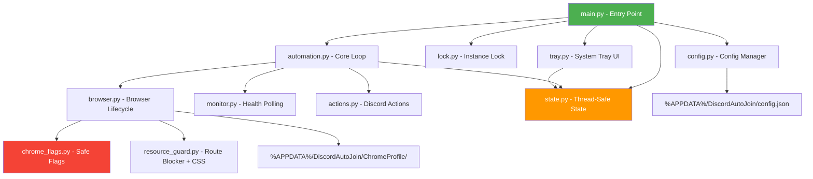
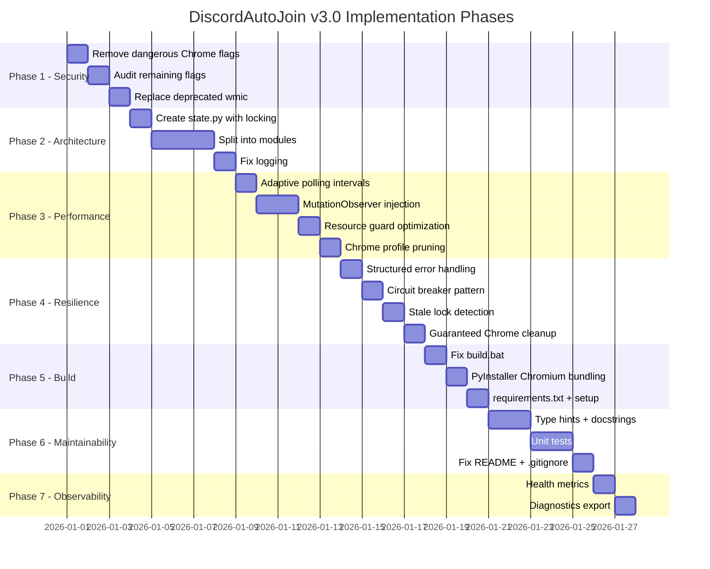

# DiscordAutoJoin v3.0 — Comprehensive Transformation Roadmap

---

## Architecture Target



**Key principle:** Every module has a single responsibility. State is centralized and thread-safe. No module-level globals.

---

## Phase 1: Security Hardening — CRITICAL PRIORITY

### 1.1 Remove Dangerous Chrome Flags

**File:** `chrome_flags.py` (new)

| Remove | Reason | Replacement |
|--------|--------|-------------|
| `--disable-web-security` | Disables Same-Origin Policy | Nothing — not needed for Discord |
| `--no-sandbox` | Removes process isolation | Nothing — sandbox stays on |
| `--disable-site-isolation-trials` | Weakens Spectre mitigations | Nothing — isolation stays on |
| `--disable-gpu-sandbox` | Weakens GPU process isolation | Nothing |

**Target:** Zero dangerous flags. All security boundaries intact.

### 1.2 Audit Remaining Flags

Keep only flags that are:
- Performance-related and safe (`--disable-background-timer-throttling`, `--disable-renderer-backgrounding`)
- Resource-limiting (`--js-flags=--max-old-space-size=128`, `--renderer-process-limit=1`)
- Cosmetic/UX (`--disable-notifications`, `--disable-prompt-on-repost`)

Remove flags that are:
- Deprecated or no-op (`--disable-dinosaur-easter-egg`, `--no-zygote` on Windows)
- Redundant (`--disable-gpu` + `--disable-gpu-compositing` + `--disable-software-rasterizer` — pick one strategy)
- Privacy-invasive in the wrong context (`--disable-web-security`)

**Target:** Reduce from 40+ flags to ~20 well-justified flags.

### 1.3 Replace Deprecated `wmic` Call

**Current:** [`lower_chrome_priority()`](DiscordAutoJoin/main.py:334) uses `wmic`
**Fix:** Use PowerShell `Get-Process` or `psutil` (already a dependency):

```python
import psutil
def lower_chrome_priority():
    for proc in psutil.process_iter(['name']):
        if proc.info['name'] == 'chrome.exe':
            try:
                proc.nice(psutil.BELOW_NORMAL_PRIORITY_CLASS)
            except Exception:
                pass
```

---

## Phase 2: Architectural Redesign — HIGH PRIORITY

### 2.1 Module Split

| New Module | Responsibility | Extracted From |
|------------|---------------|----------------|
| [`config.py`](DiscordAutoJoin/config.py) | Config loading, merging, defaults, file I/O | Lines 8-43 |
| [`state.py`](DiscordAutoJoin/state.py) | Thread-safe `AppState` with proper locking | Lines 117-133 |
| [`chrome_flags.py`](DiscordAutoJoin/chrome_flags.py) | Curated, safe Chrome argument list | Lines 46-65 |
| [`resource_guard.py`](DiscordAutoJoin/resource_guard.py) | Domain blocking regex, CSS injection, route handler | Lines 67-76, 339-346 |
| [`browser.py`](DiscordAutoJoin/browser.py) | Launch, cleanup, lock removal, priority, HWND | Lines 303-346, 242-255 |
| [`tray.py`](DiscordAutoJoin/tray.py) | Icon, menu generator, tray actions | Lines 143-256 |
| [`actions.py`](DiscordAutoJoin/actions.py) | Join voice, toggle camera, mute mic, JS snippets | Lines 268-301, 409-506 |
| [`monitor.py`](DiscordAutoJoin/monitor.py) | Health polling loop, state evaluation | Lines 457-506 |
| [`automation.py`](DiscordAutoJoin/automation.py) | Orchestrator loop, session check, backoff | Lines 348-528 |
| [`lock.py`](DiscordAutoJoin/lock.py) | Instance locking with stale-lock detection | Lines 534-542 |
| [`logging_setup.py`](DiscordAutoJoin/logging_setup.py) | Logger config, Console class, CategoryFilter | Lines 78-115 |
| [`main.py`](DiscordAutoJoin/main.py) | Entry point only — ~30 lines | Lines 544-564 |

### 2.2 Thread-Safe State

**Problem:** `state` and `icon` are module-level globals mutated from two threads.

**Solution:** [`state.py`](DiscordAutoJoin/state.py) wraps all mutable fields with `threading.RLock`:

```python
class AppState:
    def __init__(self):
        self._lock = threading.RLock()
        self._status = "Initializing"
        # ... all fields private
    
    @property
    def status(self):
        with self._lock:
            return self._status
    
    @status.setter
    def status(self, value):
        with self._lock:
            self._status = value
```

All reads and writes go through properties. No direct field access.

### 2.3 Proper Logging

- Rename `Console` to `AppLogger` — no misleading `log = Console` alias
- Add a real `OK` log level (custom level 25 between INFO and WARNING)
- Every `except: pass` becomes `except Exception as e: logger.debug(f"Non-critical: {e}")`
- Add structured logging: `logger.info("Voice joined", extra={"channel_id": ..., "attempt": n})`

---

## Phase 3: Performance Optimization — HIGH PRIORITY

### 3.1 Smart Polling with Adaptive Intervals

**Current:** Fixed [`POLL_INTERVAL`](DiscordAutoJoin/main.py:19) of 5.0 seconds — wastes CPU when connected, too slow when reconnecting.

**Solution:** Adaptive polling in [`monitor.py`](DiscordAutoJoin/monitor.py):

| State | Interval | Rationale |
|-------|----------|-----------|
| Connected + healthy | 15s | Nothing to do, save CPU |
| Connected + camera off | 5s | Need to re-enable camera |
| Connecting / retrying | 2s | Fast recovery |
| Error / disconnected | 1s | Immediate reconnection |

```python
ADAPTIVE_INTERVALS = {
    "healthy": 15.0,
    "camera_off": 5.0,
    "connecting": 2.0,
    "error": 1.0,
}
```

**Target:** 60-70% reduction in JS evaluation calls during steady state.

### 3.2 DOM Change Observer Instead of Polling

**Current:** Every poll calls [`page.evaluate(MONITOR_JS)`](DiscordAutoJoin/main.py:474) which traverses the DOM from scratch.

**Solution:** Inject a [`MutationObserver`](https://developer.mozilla.org/en-US/docs/Web/API/MutationObserver) that pushes state changes via a Promise that Python awaits:

```javascript
// Injected once at page load
window.__discordState = { joinVisible: false, camOff: false, micUnmuted: false };

const observer = new MutationObserver(() => {
    // Update __discordState only when relevant elements change
    const joinBtn = document.evaluate(joinXPath, ...);
    window.__discordState.joinVisible = !!(joinBtn && joinBtn.offsetWidth > 0);
    // ... etc
});
observer.observe(document.body, { childList: true, subtree: true, attributes: true });
```

Python side polls a lightweight getter:
```python
async def get_state(page):
    return await page.evaluate("() => window.__discordState")
```

This is O(1) per poll instead of O(DOM size).

**Target:** Poll evaluation time from ~50-200ms to <5ms.

### 3.3 Connection Health via WebSocket Monitoring

**Current:** Detects voice drop by checking for "Join Voice" button — reactive, not proactive.

**Solution:** Monitor Discord's WebSocket connection state via [`page.evaluate()`](DiscordAutoJoin/main.py:474) checking `navigator.onLine` and WebSocket readyState on Discord's internal socket. Detect disconnection before the UI updates.

### 3.4 Resource Guard Optimization

**Current:** [`BLOCKED_DOMAINS`](DiscordAutoJoin/main.py:67-71) regex is compiled once but tested against every single request URL.

**Improvements:**
- Pre-compile with `re.compile(..., re.IGNORECASE)` (already done)
- Add a fast-path: skip regex for same-origin requests (discord.com)
- Use a set for exact hostname matches before falling back to regex
- Cache blocked/allow decisions in an LRU cache (functools.lru_cache on the check function)

### 3.5 Chrome Profile Maintenance

**Problem:** [`CHROME_PROFILE_DIR`](DiscordAutoJoin/main.py:10) grows indefinitely.

**Solution:** On startup, if profile size exceeds threshold (e.g., 200MB), prune:
- Clear `Cache/`, `Code Cache/`, `GPUCache/`, `Service Worker/`
- Keep `Local Storage/`, `Cookies`, `Preferences` (login session)
- Log size before/after pruning

---

## Phase 4: Error Resilience — MEDIUM PRIORITY

### 4.1 Structured Error Handling

Replace all bare `except: pass` with:

```python
except Exception as e:
    logger.debug(f"Non-critical failure in {func_name}: {type(e).__name__}: {e}")
```

### 4.2 Retry with Circuit Breaker

**Current:** Exponential backoff exists but no circuit breaker — if Discord is down for hours, the app keeps retrying forever.

**Solution:** After N consecutive full-cycle failures, enter "cooldown mode" with 5-minute intervals and a tray notification.

### 4.3 Graceful Degradation

| Failure | Fallback |
|---------|----------|
| Camera toggle fails | Log warning, continue monitoring |
| Mic mute fails | Log warning, continue monitoring |
| Page reload fails | Restart browser context |
| Browser launch fails | Exponential backoff, then cooldown |
| Config file corrupt | Use defaults, log error, notify tray |

### 4.4 Stale Lock Detection

**Current:** [`acquire_lock()`](DiscordAutoJoin/main.py:535-542) checks if PID exists but doesn't verify it's actually the same app.

**Solution:** Store PID + process creation time in lock file. On startup, verify both match. If PID exists but creation time differs, the lock is stale — delete it and continue.

### 4.5 Chrome Process Guaranteed Cleanup

Add an `atexit` handler and a `signal` handler (SIGTERM, SIGINT) that:
1. Closes the Playwright context gracefully
2. Runs `kill_stale_chrome()` 
3. Removes the lock file

---

## Phase 5: Build & Deployment — MEDIUM PRIORITY

### 5.1 Fix build.bat

| Issue | Fix |
|-------|-----|
| 13 packages, only 3 used | Reduce to `playwright pystray pillow` |
| `keyboard` needs admin | Remove — not imported anywhere |
| Creates then deletes `dist/` | Remove redundant `mkdir dist` |
| Chrome path only `Program Files` | Also check `Program Files (x86)` |
| `--windowed` hides crash info | Add `--console` for debug builds, keep `--windowed` for release |
| Missing `--add-data` for Chromium | Add `--add-binary` for Playwright's Chromium or use `playwright stealthenv` approach |

### 5.2 PyInstaller Chromium Bundling

**Critical fix:** The built `.exe` must include Chromium. Options:

**Option A (Recommended):** Use `playwright`'s built-in browser channel:
```bash
pyinstaller --add-binary "%LOCALAPPDATA%\ms-playwright\chromium-*\chrome-win\*;playwright_browsers\chromium" ...
```

**Option B:** Use system Chrome via `channel="chrome"` (current approach) — simpler but requires Chrome installed on target machine.

### 5.3 Add a `requirements.txt`

```text
playwright>=1.40.0
pystray>=0.19.0
pillow>=10.0.0
```

### 5.4 Add a `setup.py` or `pyproject.toml`

For proper packaging metadata and dependency declaration.

---

## Phase 6: Maintainability — LOWER PRIORITY

### 6.1 Type Hints

Add type hints to all function signatures:

```python
async def safe_eval(page: Page, js: str, timeout: float = 10) -> Optional[dict]:
    ...
```

### 6.2 Docstrings

Add Google-style docstrings to all public functions:

```python
def load_config() -> dict:
    """Load configuration from disk, merging with defaults.
    
    Returns:
        dict: Merged configuration dictionary. Missing keys are filled from DEFAULT_CONFIG.
    """
```

### 6.3 Unit Tests

Create `tests/` directory with:
- `test_config.py` — Config loading, merging, missing file, corrupt file
- `test_state.py` — Thread safety, property access
- `test_lock.py` — Lock acquire, stale lock, release
- `test_resource_guard.py` — URL matching, blocking logic

### 6.4 Fix README.md

- Replace "First-Run Done" with "Confirm Login Done"
- List actual dependencies
- Document `build.bat` usage
- Add troubleshooting section

### 6.5 Fix .gitignore

- Remove `DiscordAutoJoin/ChromeProfile/` (profile is in `%APPDATA%`)
- Add `DiscordAutoJoin/venv/`, `DiscordAutoJoin/dist/`, `DiscordAutoJoin/build/`
- Add `DiscordAutoJoin/*.spec`

---

## Phase 7: Monitoring & Observability — LOWER PRIORITY

### 7.1 Health Metrics

Track and expose via tray submenu:
- Uptime (already done)
- Restart count (already done)
- Successful join rate (joins / attempts)
- Average session duration
- Memory usage of Chrome processes
- Profile directory size

### 7.2 Structured Log Export

Add a "Export Diagnostics" tray option that writes a JSON snapshot:
```json
{
  "uptime_seconds": 3600,
  "restart_count": 2,
  "sessions": [
    {"start": "...", "end": "...", "duration": 1800, "disconnects": 1}
  ],
  "chrome_memory_mb": 350,
  "profile_size_mb": 120
}
```

---

## Implementation Order & Dependencies



---

## Measurable Efficiency Targets

| Metric | Current | Target | How |
|--------|---------|--------|-----|
| Chrome flags count | 40+ | ~20 | Remove dangerous + redundant flags |
| JS eval time per poll | 50-200ms | <5ms | MutationObserver + cached state |
| Polls per minute (steady state) | 12 | 4 | Adaptive 15s interval when healthy |
| Module count | 1 file | 12 files | Architectural split |
| Bare `except: pass` blocks | 10+ | 0 | Structured error handling |
| Unused pip dependencies | 10 | 0 | Clean requirements.txt |
| Thread-unsafe state mutations | All of them | 0 | RLock-protected properties |
| Memory leak (profile growth) | Unlimited | Capped at 200MB | Startup pruning |
| Orphaned Chrome on crash | Yes | No | atexit + signal handlers |
| PyInstaller .exe works standalone | No | Yes | Bundled Chromium |

---

## Risk Assessment

| Risk | Likelihood | Impact | Mitigation |
|------|-----------|--------|------------|
| Module split breaks imports | Medium | High | Do split first, test each import path |
| MutationObserver misses edge cases | Low | Medium | Fall back to full DOM eval every 10th poll |
| Removing `--no-sandbox` breaks on restricted systems | Low | Low | Detect and conditionally re-add only if needed |
| PyInstaller Chromium bundling fails | Medium | Medium | Fall back to system Chrome channel |
| Adaptive polling misses rapid state changes | Low | Low | MutationObserver is event-driven, not poll-dependent |